Aceasta este soluția propusă de mine pentru problema pentru **Internship .Net Siemens 2025.**

Am realizat o aplicație la **consolă** pentru a vă ușura procesul de configurare, considerând că,
în situația de față, este mai importantă verificare funcționalităților și a arhitecturii codului, decât aspectul (la care,
dacă va fi cazul, voi insista mai mult în viitor). Am încercat ca mesajele și informațiile oferite
în consolă să fie cât mai prietenoase și intuitive pentru utilizator.

Tot ce trebuie să faceți pentru a rula aplicația este să **clonați** repository-ul publicat
pe GiHub și să-l rulați într-un IDE cu .NET 8+.

Pentru **persitență** am folosit o bază de date **SQLite** și **Entity Framework**.
Am ales SQLite pentru că nu necesită un server separat, este **embedded**,
ceea ce înseamnă că baza de date este doar un **fișier** . Acest lucru este foarte convenabil și util
în acest context, deoarece am plasat fișierul bazei de date în directorul proiectului, deci aplicația
poate fi rulată fără instalarea unui software suplimentar.

**FUNCȚIONALITĂȚILE PROPUSE DE MINE:**
1. Am consiedart că este utilă **vizualizarea împrumuturilor**. Se poate alege ce fel de împrumuturi
se doresc a fi vizulizate: toate, cele returnate, sau cele nereturnate.
2. **Vizualizarea împrumuturilor nereturnate care au depășit data limită de retunare** (am considerat
că data limită de retunare a unui împrumut este de 3 săptămâni).
3. **Vizualizarea cărților împrumutate în anul curent, ordonate descrescător în funcție de câte ori
au fost împrumutate**. (Un fel de top al celor mai împrumutate cărți, doar că acesta cuprinde toate cărțile
împrumutate.)

Am tratat corespunzător cazurile excepționale și am asigurat faptul că nu se pot împrumuta
mai multe exemplare ale unei cărți dacă nu sunt atâtea și că nu se pot retuna mai multe cărți decât
numărul exemplarelor pe care le deține biblioteca.

De asemnea, am adăugat și specifiațiile corepsunzătoare fiecărei metode.

<ins>Alte precizări:</ins>

Inițial, am dorit să creez un GUI folosind Windows Forms, însă am realizat
că această alegere nu era cea mai potirvită. Motivul principal este că
Windows Forms este dependent de Windows, ceea ce înseamnă că cineva care verifică
aplicația și folosește macOS sa Linux nu ar putea rula aplicația corect.

Din acest motiv, am ales să dezvolt aplicția la consolă, ceea ce face procesul
de testare și de verifcare mult mai accesibil, indiferent de sistemul de operare folosit.

Pe viitor, intenționez să dobândesc și cunoștiințe despre tehnologii în care se
pot dezvolta aplicații GUI cross-paltform, precum Avalonia sau MAUI.

<ins>Descrierea modului de utilizare:</ins>
La început vor apărea opțiunile posibile:

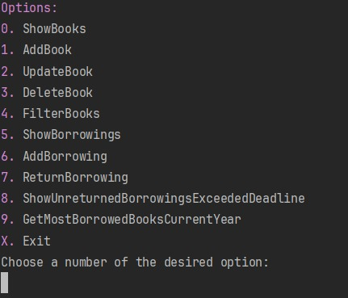

Dacă tastați **0**, vor **apărea toate cărțile**:

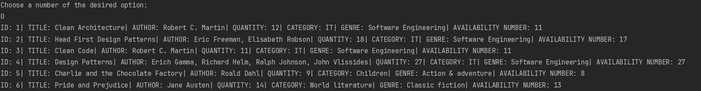

Dacă tastați **1**, înseamnă că doriți **adugarea unei cărți**.
Vi se vor cere pe rând datele cărții, iar la final, dacă adăugarea
este realizată cu succes, vi se va afișa un mesaj verde de confirmare,
altfel unul roșu în care sunt menționate erorile.

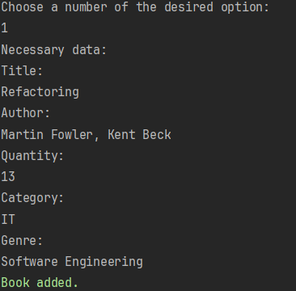

Dacă tastați **2**, înseamnă că doritți **modificare unei cărți**.
Vi se vor cere pe rând datele cărții (noi), iar la final, dacă modificarea
este realizată cu succes, vi se va afișa un mesaj verde de confirmare,
altfel unul roșu în care sunt menționate erorile.

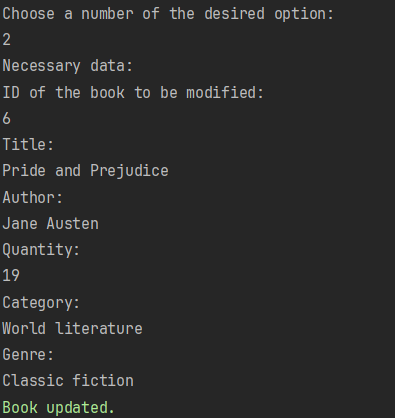

Dacă tastați **3**, veți opta pentru **ștergerea unei cărți**, în acest caz
vi se va cere ID-ul cărții pe care doriți să o ștergeți. Dacă ștergerea
este realizată cu succes, vi se va afișa un mesaj verde de confirmare,
altfel unul roșu în care sunt menționate erorile.

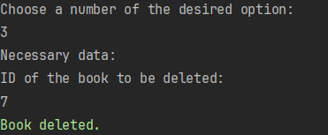

Dacă tastați **4**, optați pentru **filtrarea cărților**, în acest caz, vi se vor afișa
criteriile disponibile de filtrare și trebuie să completați cu valorile corespunzătoare
filtrărilor pe care doriți să le faceți.

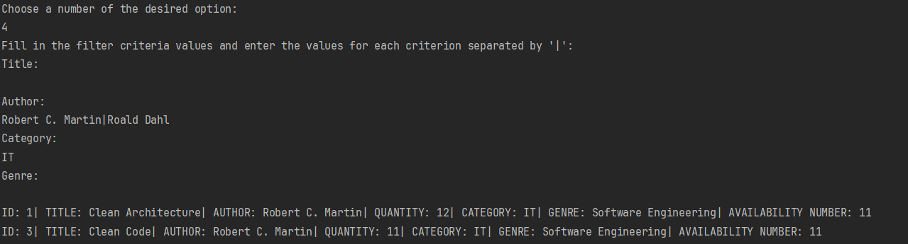

Dacă tastați **5**, veți opta pentru **afișarea împrumuturilor**. Vi se va 
cere să completați cu tipul de vizualizare: **all**(toate), **returned**(cele returnate)
sau **not returned**(cele nereturnate).

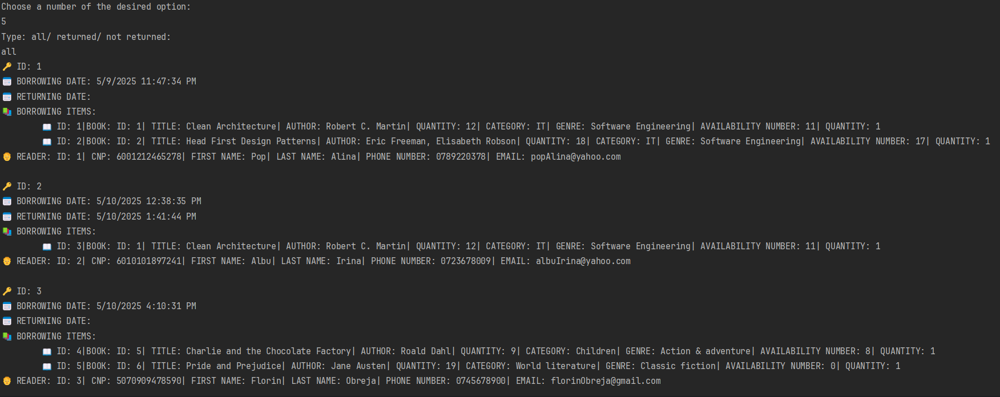

Dacă tastați **6**, veți opta pentru **adăugarea/realizarea unui împrumut**.
Vi se vor cere datele persoanei/cititorului care realizeză împrumutul, iar apoi
ID-urile cărțior ce se doresc a fi împrumutate, iar pentru fiecare carte,
cantitatea corespunzătoare din fiecare carte ce se dorește a fi împrumutată.
Pentru a adăuga încă o carte în lista de cărți împrumutate vi se cere să
tastați **+**, iar dacă nu mai doriți să adăugați și alte cărți, trebuie
să tastați **x**. Dacă adăugarea este realizată cu succes, vi se va afișa un mesaj verde de confirmare,
altfel unul roșu în care sunt menționate erorile.

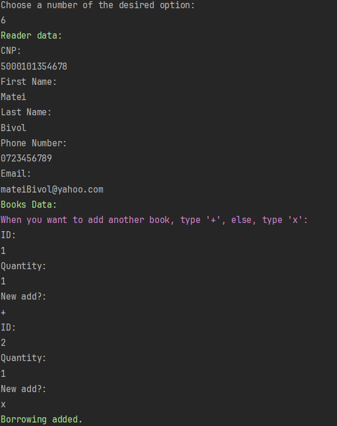

Dacă tastați **7**, veți opta pentru **returnarea unui împrumut**. Vi se va cere
ID-ul îmrpumtului. Dacă împrumutl este realizat cu succes, vi se va afișa un mesaj verde de confirmare,
altfel unul roșu în care sunt menționate erorile.

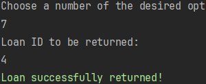

Dacă tastați **8**, se vor **afișa împrumuturile neretunate, care au
depășit termenul limită de returnare** sau un mesaj care specifică faptul că
nu sunt astfel de împrumuturi.

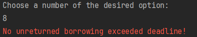

Dacă tastați **9**, se vor afișa cărțile împrumutate în anul curent, ordonate descrescător în funcție de câte ori
au fost împrumutate**.

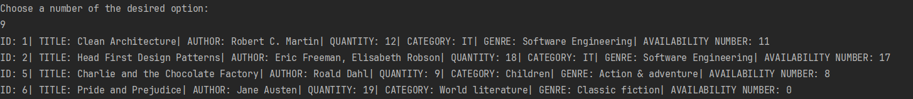

Dacă tastați **X**, veți **ieși/ închide aplicația**.

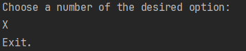